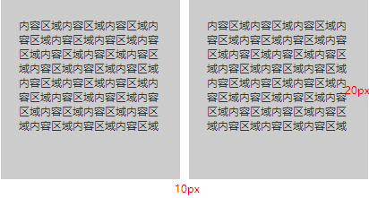

### 基础样式

> ###### 字体规范

+ 页面通用字号：12px regular #666
+ 标题字号：12px bold #333
+ 表头字号：13px bold #19AA8D

<iframe src="../base-style/base-color.html" width="100%" style="border:none;height:1750px"></iframe>
